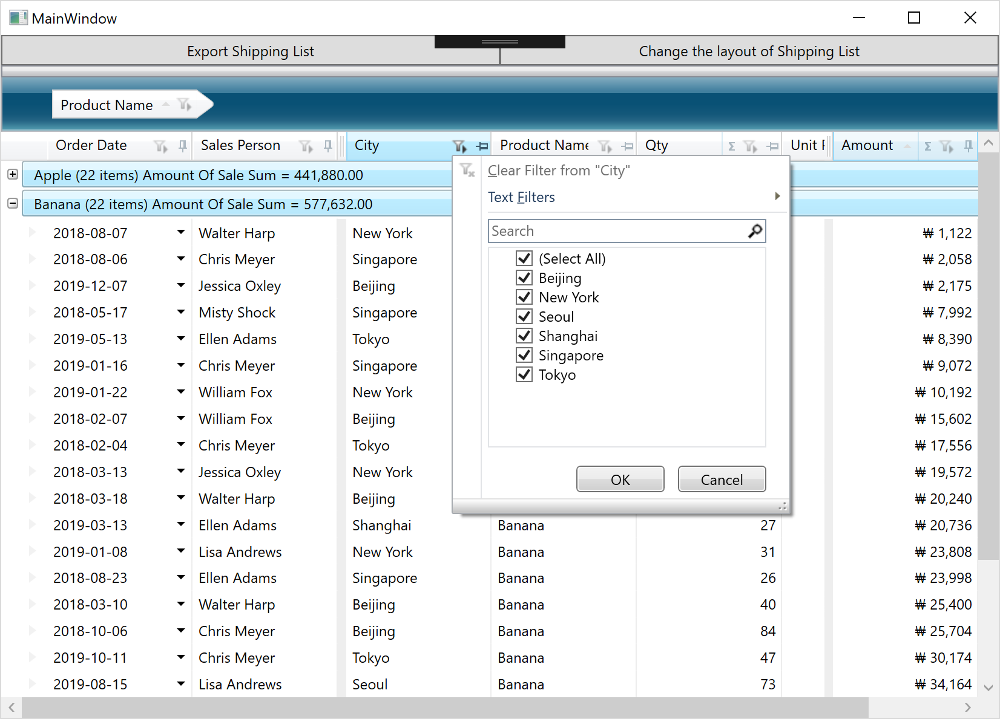
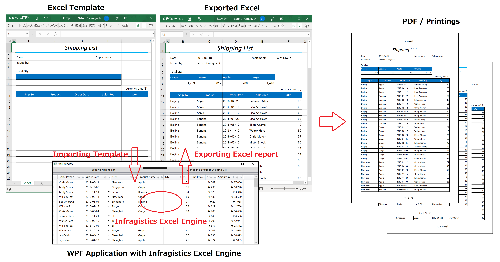
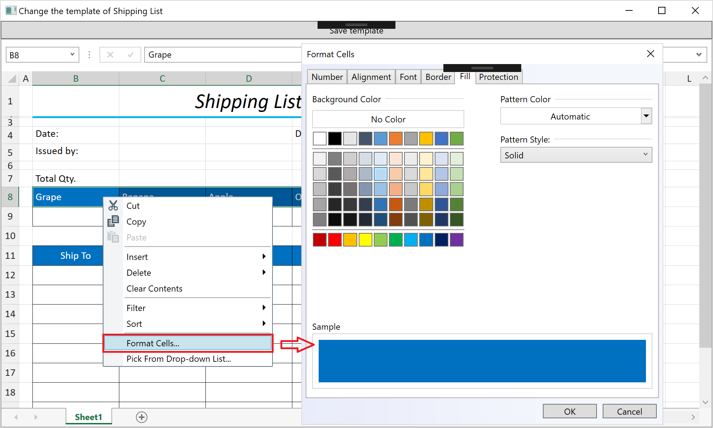

# Infragistics WPF hands-on workshop

## About this workshop

This workshop is for those who 
- want to try Infragistics products in WPF application development
- are looking for rich and fast WPF UI controls
- are looking for a library which can do importing & exporting Excel / manupirating Excel object / displaying Excel on spreadsheet on WPF application
- are looking for a reporting solution

You can experience how to build WPF app with Infragistics WPF controls and see its productivity through this workshop.

*If you want to use chart / graph / pivot UI, then check [the another workshop](https://github.com/gdayori/infragistics-wpf-workshop).

## Check your environment

Before starting this hands-on workshop please check your environment to see if you're ready.

[Required Environment](docs/00-Environment.md)

## Application for the workshop

Download the copy of this repository and find infragistics-wpf-workshop-excel/src/before/IgWpfWorkshop which would be the start project of this workshop. This project has all Models and ViewModels required in the workshop but the views have empty so that you can focus on creating views with Infragistics products. Please open it with Visual Studio and build to see if it can work on your PC.

Note that there's src/02-After folder which contains the project completing all instructions in this workshop.

## All steps

1. [Section 1 - Get started with Infragistics grid control](docs/01-Use-Infragistics-Grid-control/01-00-Overview-of-Section1.md)
    1. [Get started with XamDataGrid](docs/01-Use-Infragistics-Grid-control/01-01-Get-started-with-XamDataGrid.md)
    2. [Define columns](docs/01-Use-Infragistics-Grid-control/01-02-Define-Columns.md)
    3. [Configure XamDataGrid](docs/01-Use-Infragistics-Grid-control/01-03-Configure-XamDataGrid.md)
2. [Section 2 - Reporting with Excel](docs/02-Reporting-with-Excel/02-00-Overview-of-Section2.md)
    1. [Check Template Excel](docs/02-Reporting-with-Excel/02-01-Check-Template-Excel.md)
    2. [Load Excel](docs/02-Reporting-with-Excel/02-02-Load-Excel.md)
    3. [Merge data into Excel](docs/02-Reporting-with-Excel/02-03-Merge-data-into-Excel.md)
3. [Section 3 - Modify template on Spreadsheet UI](docs/03-Modify-template-on-Spreadsheet/03-00-Overview-of-Section3.md)
    1. [Load template into XamSpreadsheet](docs/03-Modify-template-on-Spreadsheet/03-01-Load-template-into-XamSpreadsheet.md)
    2. [Modify template](docs/03-Modify-template-on-Spreadsheet/03-02-Modify-template.md)

## What you build through this workshop.
Section 1 - Use Infragistics grid control

Section 2 - Reporting with Excel

Section 3 - Modify the Excel template on Spreadsheet control

