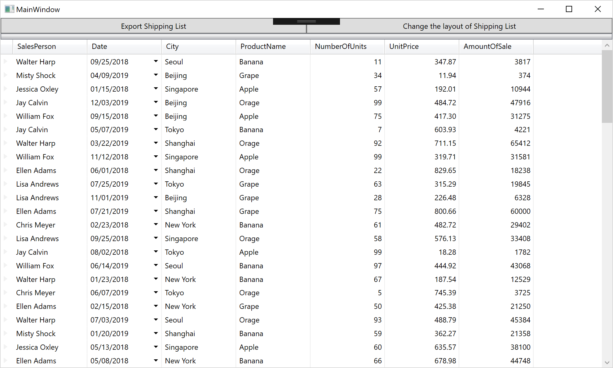

# Get started with XamDataGrid

If you have installed Infragistics WPF controls, all controls should be ready in the Toolbox in your Visual Studio. You can use them just like you develop with Common WPF Controls.

Please open the project in "01-Before" folder you downloaded. The file path should be infragistics-wpf-workshop-excel/src/01-Before.

## Check MainWindowViewModel.cs

Open MainWindowViewModel.cs and check what's in the class.

```cs
...
public ICommand ExportShippingList { get; set; }
public ICommand OpenSpreadsheet { get; set; }

public MainWindowViewModel()
{
    //Get sales data to be bound to grid
    SalesDataSample salesDataSample = new SalesDataSample();
    salesRecords = salesDataSample.SalesData;

    // Commands
    ExportShippingList = new ExportShippingListCommand(this);
    OpenSpreadsheet = new OpenSpreadsheetCommand();
}

private ObservableCollection<Sale> salesRecords;
public ObservableCollection<Sale> SalesRecords
{
    get { return salesRecords; }
}
...
    
```

This class has
 - SalesRecords to be bound to XamDataGrid
 - ExportShippingList to export Shipping List (used in the section 2)
 - OpenSpreadsheet to bring up the Spreadsheet window (used in the section 3)

## Check MainWindow.xaml

Open MainWindow.xaml and check what's in the xaml.
```xml
<Window
        xmlns="http://schemas.microsoft.com/winfx/2006/xaml/presentation"
        xmlns:x="http://schemas.microsoft.com/winfx/2006/xaml"
        xmlns:d="http://schemas.microsoft.com/expression/blend/2008"
        xmlns:mc="http://schemas.openxmlformats.org/markup-compatibility/2006"
        xmlns:local="clr-namespace:IgWpfWorkshop"
        xmlns:vm="clr-namespace:IgWpfWorkshop.ViewModel" xmlns:Custom="http://infragistics.com/DataPresenter" x:Class="IgWpfWorkshop.MainWindow"
        mc:Ignorable="d"
        Title="MainWindow" Height="600" Width="1000"
        >
    <Window.DataContext>
        <vm:MainWindowViewModel/>
    </Window.DataContext>
    <Grid>
        <Grid.ColumnDefinitions>
            <ColumnDefinition Width="*"/>
            <ColumnDefinition Width="*"/>
        </Grid.ColumnDefinitions>
        <Grid.RowDefinitions>
            <RowDefinition Height="25px"/>
            <RowDefinition Height="*"/>
        </Grid.RowDefinitions>
        <Button Content="Export Shipping List" Command="{Binding ExportShippingList}" Grid.Column="0"/>
        <Button Content="Change the layout of Shipping List" Command="{Binding OpenSpreadsheet}" Grid.Column="1"/>
    </Grid>
</Window>

```

This xaml has
 - MainWindowViewModel bound to this view
 - Grid Column/Row definitions to split and layout the screen
 - Two buttons bound to commands defined in the ViewModel

## Add XamDataGrid in MainWindow.xaml

Open MainWindow.xaml and drag XamDataGrid in your Toolbox and drop into the designer. Reset the layout of XamDataGrid and bind the grid to SalesRecords by setting the DataSource property.

MainWindow.xaml

```xml
・・・
<Custom:XamDataGrid DataSource="{Binding Path=SalesRecords}" Grid.Row="1" Grid.ColumnSpan="2"/>
・・・
```

## Check the result

Run the app and check the result.



## Note

XamDataGrid has a capability of generating column definitions automatically corresponding to the bound data. If you want to configure columns to display in detail you need to set AutoGenerateFields property to False and define all fields. 

## Next
[01-02 Define Columns](01-02-Define-Columns.md)
