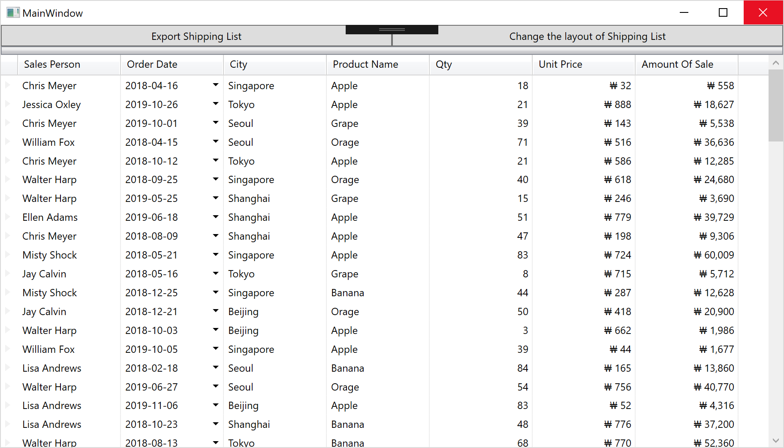

# Define Fields

XamDataGrid generates field definitions automatically corresponding to the bound data if there's no field definitions. In this step, define all fields so you can configure field settings in detail.

## Define and format fields

Open MainWindow.xaml and define all fields in the FieldLayoutSettings section as below.

```xml
...
<Custom:XamDataGrid Grid.Row="1" Grid.ColumnSpan="2" DataSource="{Binding Path=SalesRecords}">
    <!-- ↓↓↓ Added ↓↓↓ -->
    <Custom:XamDataGrid.FieldLayouts>
        <Custom:FieldLayout Key="SalesData">
            <Custom:FieldLayout.Fields>
                <Custom:TextField Name="SalesPerson" Label="Sales Person" />
                <Custom:DateTimeField Name="Date" Label="Order Date" Format="yyyy-MM-dd" />
                <Custom:TextField Name="City" Label="City" />
                <Custom:TextField Name="ProductName" Label="Product Name" />
                <Custom:NumericField Name="NumberOfUnits" Label="Qty" />
                <Custom:CurrencyField Name="UnitPrice" Label="Unit Price" Format="₩ #,###" />
                <Custom:CurrencyField Name="AmountOfSale" Label="Amount Of Sale" Format="₩ #,###" />
            </Custom:FieldLayout.Fields>
        </Custom:FieldLayout>
    </Custom:XamDataGrid.FieldLayouts>
    <!-- ↑↑↑ Added ↑↑↑ -->
</Custom:XamDataGrid>
...
```

Note that you can specify the field type like DateTimeField, NumericField and CurrencyField so those fields get formatted automatically. If you want to format fields with your own format string, the use Format property as above code.

## Check the result

Run the app and check the result.



## Note
If you want to learn more about field layout on XamDataGrid, check the help topic from the below link.

[XamDataGrid Field layouts](https://www.infragistics.com/help/wpf/xamdatapresenter-define-a-field-layout)

## Next
[01-03 Configure XamDataGrid](01-03-Configure-XamDataGrid.md)
