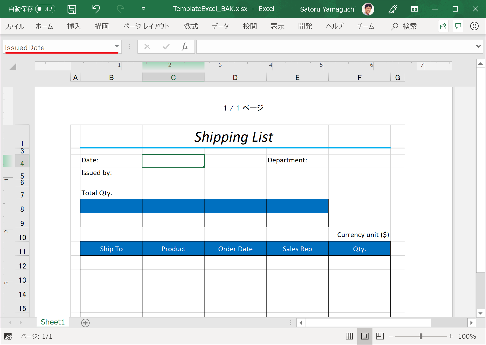

# Reporting with Excel

In this section, you’ll add a capability to export Shipping List as an Excel file, by importing Excel template file and exporting it with sales data, by using Infragistics Excel Engine.

## Steps
1. [Check Template Excel](02-01-Check-Template-Excel.md)
2. [Load Excel](02-02-Load-Excel.md)
3. [Merge data into Excel](02-03-Merge-data-into-Excel.md)

## Next
[02-01 Check Template Excel](02-01-Check-Template-Excel.md)