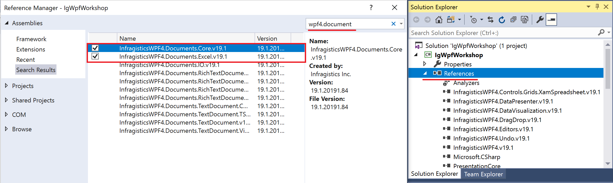
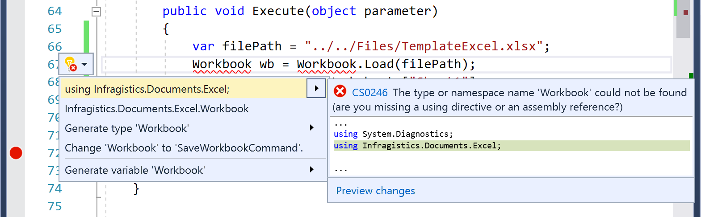
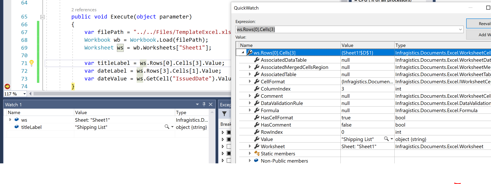

# Load Excel file in the allication

Loading a template Excel file for Shipping List by Excel Engine.

## Add references for Excel Engine

Inthe Solution Explorer, right click on "References" and the select "Add Reference..." on the context menu



Search "wpf4.document" and add below 2 references on the Reference Manager dialog.

- InfragisticsWPF4.Documents.Core.v19.1
- InfragisticsWPF4.Documents.Excel.v19.1

## Load template Excel and see Excel object in the application

Open MainWindowViewModel.cs and write some code in the Execute function of ExportShippingListCommand. This Function is called when user click "Export Shipping List" button.

MainWindowViewModel.cs

```cs
...
public class ExportShippingListCommand : ICommand
{
    ...
    public void Execute(object parameter)
    {
        // ↓↓↓ Added ↓↓↓
        var filePath = "../../Files/TemplateExcel.xlsx";
        Workbook wb = Workbook.Load(filePath);
        Worksheet ws = wb.Worksheets["Sheet1"];

        var titleLabel = ws.Rows[0].Cells[3].Value;
        var dateLabel = ws.Rows[3].Cells[1].Value;
        var dateValue = ws.GetCell("IssuedDate").Value;
        // ↑↑↑ Added ↑↑↑
    }
}
...
```

You would get an error like "Workbook cound't be found" by missing using statement. Add "using Infragistics.Documents.Excel" by hitting ctrl + . on Workbook.



## Check the result

Set the breakpoint on the last line of the Excecute function and debug the app to see how you can access to the Loaded Excel object and cells.



## Note

You can learn more about XamTileManager in the help topic.

[Using the Infragistics Excel Engine](https://www.infragistics.com/help/wpf/excelengine-using-the-infragistics-excel-engine)

## Next
[02-03 Configure PieChart](02-03-Configure-PieChart.md)
