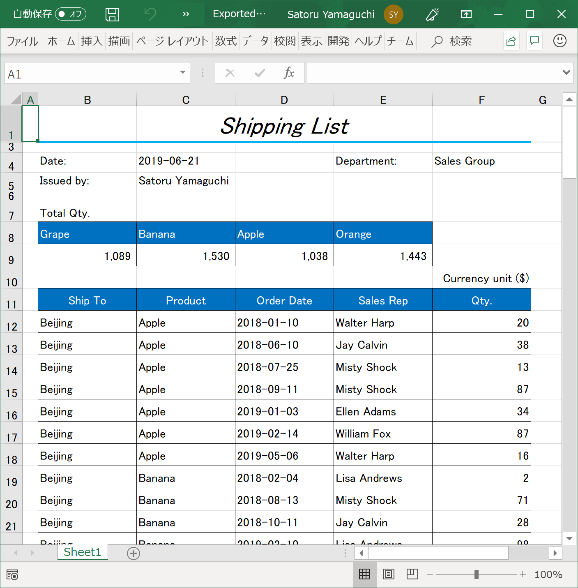

# Merge data into the loaded template Excel

## Get data from SalesRecords inside ViewModel

Get data to marge into Shipping List from SalesRecords inside ViewModel which is bound to XamDataGrid as below code.

- salesRecordsOrdered contains records ordered by City, ProductName and Date for Shipping List.
- qtyByProduct contains the number of shipping quantity for each product.

MainWindowViewModel.cs

```cs
...
public void Execute(object parameter)
{
    var filePath = "../../Files/TemplateExcel.xlsx";
    Workbook wb = Workbook.Load(filePath);
    Worksheet ws = wb.Worksheets["Sheet1"];

    // ↓↓↓ Added ↓↓↓
    // ********************
    // Get data from vm Sales Records
    // ********************
    List<Sale> salesRecordsOrdered = _vm.SalesRecords
                                            .OrderBy(rec => rec.City)
                                            .ThenBy(rec => rec.ProductName)
                                            .ThenBy(rec => rec.Date)
                                            .ToList<Sale>();

    Dictionary<string, int> qtyByProduct = (from x in _vm.SalesRecords
                                            group x by x.ProductName into A
                                            select new { product = A.Key, NumberOfUnits = A.Sum(a => (int)a.NumberOfUnits) })
                                            .ToDictionary(a => a.product, a => a.NumberOfUnits);

    // ↑↑↑ Added ↑↑↑
}
...
```

## Merge data into the template for Shipping List

Set data to specific cells to merge sales data into Shipping List template at the last of Execute() function as below.

MainWindowViewModel.cs

```cs
...
public void Execute(object parameter)
{
    ...
    ...
    ...
    // ↓↓↓ Added ↓↓↓
    // ********************
    // Marge data into Excel
    // ********************
    // Marge data for header part
    ws.GetCell("IssuedDate").Value = DateTime.Now;
    ws.GetCell("IssuedBy").Value = "Your Name";
    ws.GetCell("Dept").Value = "Sales Group";
    // Marge data for quantity list by product in header part
    for (var i = 1; i <= 4; i++)
    {
        var productName = ws.GetCell("ProductName" + i.ToString()).Value.ToString();
        if (qtyByProduct.ContainsKey(productName))
            ws.GetCell("ProductQty" + i.ToString()).Value = qtyByProduct[productName];
    }
    // Marge data for record part
    for (var rowIndex = 0; rowIndex < salesRecordsOrdered.Count(); rowIndex++)
    {
        ws.Rows[11 + rowIndex].Cells[1].Value = salesRecordsOrdered[rowIndex].City;
        ws.Rows[11 + rowIndex].Cells[2].Value = salesRecordsOrdered[rowIndex].ProductName;
        ws.Rows[11 + rowIndex].Cells[3].Value = salesRecordsOrdered[rowIndex].Date;
        ws.Rows[11 + rowIndex].Cells[4].Value = salesRecordsOrdered[rowIndex].SalesPerson;
        ws.Rows[11 + rowIndex].Cells[5].Value = salesRecordsOrdered[rowIndex].NumberOfUnits;
    }
    // ↑↑↑ Added ↑↑↑
}
...
```

## Export Shipping List as Excel

Export Excel object merged with sales data as Excel file at the last of Execute() function.

MainWindowViewModel.cs

```cs
...
public void Execute(object parameter)
{
    ...
    ...
    ...
    // ↓↓↓ Added ↓↓↓
    try
    {
        // Export the Excel object
        var exportedFilePath = "../../Files/ExportedExcel.xlsx";
        wb.Save(exportedFilePath);

        // Open the exported Excel file
        var stFilePath = System.IO.Path.GetFullPath(exportedFilePath);
        System.Diagnostics.Process.Start(stFilePath);
    }
    catch (Exception) { Console.WriteLine("Exception occurred"); }
    // ↑↑↑ Added ↑↑↑
}
...
```

## Check the result

Run the app and try exporting Shipping list to check the result.



## Note

 There's DataPresenterExcelExporter class which has a capability to export XamDataGrid as Excel file with a single line of code. If you just want to export grid as Excel, it's easier to export Excel by using Excel exporter than by setting all cell values with Excel engine. 

You can learn about Excel Exporter from the below link.

[Export a DataPresenter Control to Excel](https://www.infragistics.com/help/wpf/xamdatapresenter-export-a-datapresenter-control-to-excel)

## Next
[Overview of Section3](../03-Modify-template-on-Spreadsheet/03-00-Overview-of-Section3.md)
