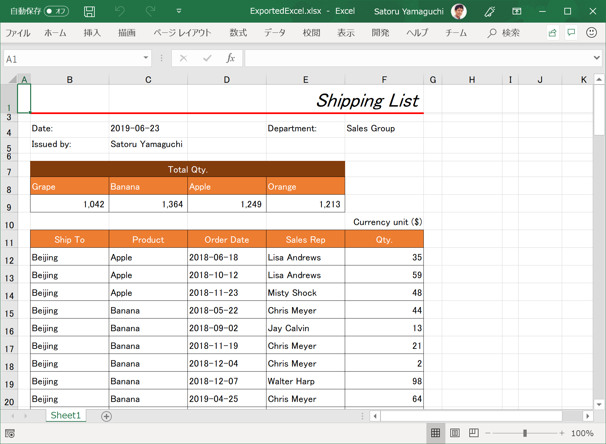
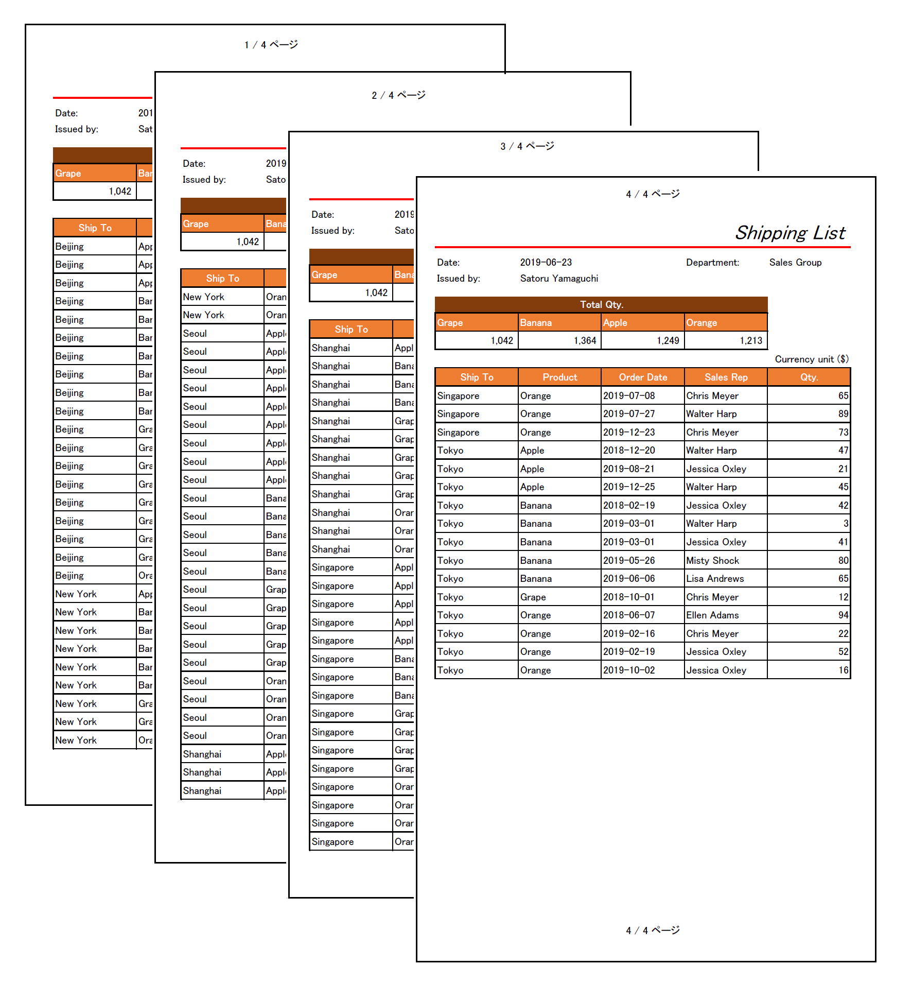

# Save the Excel template

## Save the Workbook object to the Excel template

Call Save() method of Workbook object in Execute() function of SaveWorkbookCommand class.

SpreadsheetViewModel.cs

```cs
...
public class SaveWorkbookCommand : ICommand
{
    ...
    ...
    ...
    public void Execute(object parameter)
    {
        // ↓↓↓ Added ↓↓↓
        _vm.Workbook.Save("../../Files/TemplateExcel.xlsx");
        // ↑↑↑ Added ↑↑↑
    }
}
...
```

## Check the result

Run the app and open the Spreadsheet window. Change background color, column width, row height and cell format as you like. Right click on cells and select "Format Cells..." on the context menu (or just hit Ctrl + 1), you can change formats on the "Format Cells" dialog same as you can do on the MS Excel.


After you completed to make the new template, click "Save template" and close the Spreadsheet window to go back to the MainWindow.

At last, click "Export Shippling List" to see if the the Shippling List is exported based on the new tamplate you modified on XamSpreadsheet.



Export as PDF on the Excel (Menu => File => Export => Create PDF/XPS) to see how it looks if it's printed out.



## Note

You can learn about XamSpreadsheet more from the below link.

[Online help XamSpreadsheet](https://www.infragistics.com/help/wpf/spreadsheet)

Using Ribbon control with Spreadsheet control makes the app more Office friendly and it would be easy for users to manupilate Spreadsheet like they do on MS Excel.

You can refer the application sample with XamSpreadsheet conrtol and XamRibbon control which is inspired by MS Excel, from below link.

[WPF Application sample](https://www.infragistics.com/resources/sample-applications#wpf)
*Choose "Excel-Inspired UI".

## Next
[02-03 Configure PieChart](02-03-Configure-PieChart.md)
